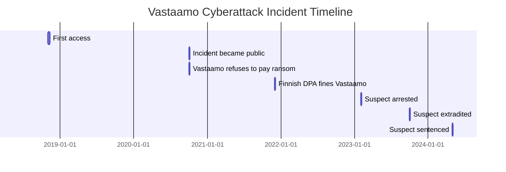

## What happened?

In October 2020, a significant cybersecurity incident served as a stark reminder of the importance of robust cybersecurity measures, particularly concerning medical information.

Vastaamo, a Finnish private psychotherapy service provider, fell victim to a cyberattack that resulted in the exposure of sensitive patient data. The perpetrators attempted to extort Vastaamo and its clients, threatening to publish the records if a ransom of 40 bitcoins (approximately 450,000 euros at the time) was not paid.

## Unfortunately, the most important part

When the company refused to pay the ransom, Aleksanteri Julius Kivimäki, the suspect behind the breach, decided to blackmail the patients instead. He sent thousands of emails threatening to publish their personal details and consultation notes. The information he threatened to release was highly sensitive and personal, with the potential to devastate the victims' lives. 

> Some patients from the Vastaamo psychotherapy centre had died by suicide after their patient records were stolen and used in extortion attempts, according to a lawyer representing victims.[^footnote]

While publishing the data of patients who did not pay the ransom on a daily basis, Kivimäki accidentally uploaded his entire home directory, which contained SSH keys, server usage logs, passwords, and, regrettably, all the patient information.

## Information Security is not a joke

Despite the gravity of the situation, the company’s security practices were found to be inadequate. The sensitive data was neither encrypted nor anonymized, and the system root did not have a defined password. Intruders first accessed the patient records in November 2018, with security problems persisting until March 2019.

In December 2021, the Finnish Data Protection Authority (DPA) fined Vastaamo 608,000 euros for violating the provisions of the General Data Protection Regulation (GDPR). This cyberattack became the biggest criminal case in Finland’s history.

## The end of the story

The suspect, Aleksanteri Julius Kivimäki, was charged in absentia at the Helsinki District Court with aggravated data breach, aggravated attempted extortion, aggravated distribution of information infringing private life, blackmail, breach of confidentiality, and falsification of evidence. He was arrested in France in February 2023. After being extradited to Finland, he was charged in October 2023. Finally, in May 2024, he was found guilty of stealing confidential therapy notes to blackmail thousands of patients and was sentenced to six years and three months in prison.

## Timeline

[^footnote]: <https://yle.fi/a/74-20077285>

