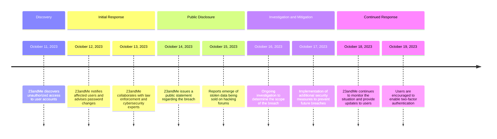

## What Happened?

In one of 2023’s most notorious data breaches, genetic testing giant 23andMe fell victim to a credential-stuffing attack. Initially, the company reported that only 0.1% of its customers (approximately 14,000 individuals) were affected. However, further investigation revealed that the breach impacted a much larger group—approximately 6.9 million users. The stolen data included personal information such as names, birth years, relationship labels, the percentage of DNA shared with relatives, ancestry reports, and self-reported locations. [^wiki]

## Immediate Impact

The breach compromised sensitive genetic information, posing risks of identity theft and discrimination based on genetic data. Unlike other types of personal information, genetic data is immutable and has profound implications for privacy and security when compromised. The stolen data was even put up for sale on various hacking forums, exacerbating the potential misuse of the exposed information.

## Nature of the Attack

The breach resulted from a credential-stuffing attack, where attackers exploited previously breached usernames and passwords to gain unauthorized access to 23andMe accounts. The attacker responsible for the breach specifically targeted certain ethnic groups, including Ashkenazi Jews and ethnically Chinese users, offering their data for sale.

## Response and Resolution

Upon discovering the breach, 23andMe took immediate steps to mitigate the damage. The company notified affected users and urged them to change their passwords and enable two-factor authentication to enhance account security. Additionally, 23andMe collaborated with law enforcement and cybersecurity experts to investigate the breach and prevent further unauthorized access. The company emphasized its commitment to strengthening its security measures to protect user data more effectively in the future.

## Lessons Learned

### 1. **Genetic Data Vulnerability**

This incident highlighted the unique risks associated with the storage and handling of genetic data. Unlike other types of personal information, genetic data is immutable and can have profound implications for privacy and security if compromised.

### 2. **The Importance of Strong Authentication**

The breach underscored the necessity of robust authentication mechanisms. Organizations must implement multi-factor authentication and encourage users to employ strong, unique passwords to mitigate the risk of credential-stuffing attacks.

### 3. **User Awareness and Education**

Educating users about the importance of cybersecurity practices is crucial. Users should be informed about the risks of reusing passwords across multiple platforms and the benefits of using password managers to create and store complex passwords securely.

### 4. **Incident Response and Preparedness**

The 23andMe breach demonstrated the need for comprehensive incident response plans. Companies must be prepared to respond swiftly to security incidents, communicate transparently with affected users, and take immediate corrective actions to prevent further damage.

## Timeline

[^wiki]: <https://en.wikipedia.org/wiki/23andMe_data_leak>