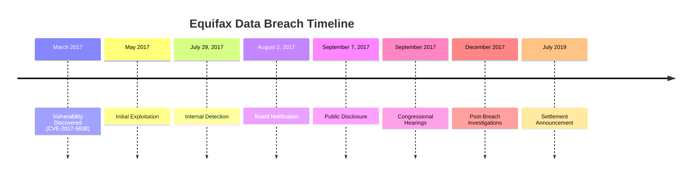

## What Happened?

In one of 2017’s most notorious data breaches, credit reporting giant Equifax fell victim to a cyber attack that exposed sensitive information of 147 million people. Attackers exploited a vulnerability (CVE-2017-5638) in the Apache Struts web application framework used by Equifax. Despite a patch being available, Equifax had not applied it in a timely manner. This allowed attackers to access sensitive data including names, social security numbers, birth dates, addresses, and in some cases, driver's license numbers and credit card information.

## The Vulnerability

The vulnerability in Apache Struts, CVE-2017-5638, was a remote code execution flaw that allowed attackers to execute arbitrary code on the server by sending a specially crafted HTTP request. The flaw was disclosed in March 2017, but Equifax failed to apply the patch released by Apache.

##  Attack Execution

The attackers first gained access to Equifax's systems in mid-May 2017. They exploited the Apache Struts vulnerability to penetrate Equifax’s web applications and then moved laterally across the network. The attackers set up encrypted tunnels to exfiltrate data without detection.

## Immediate Impact

The breach had severe and immediate impacts. It compromised highly sensitive personal information, putting millions at risk of identity theft and fraud. The breach eroded consumer trust in Equifax, led to a significant drop in the company’s stock price, and triggered widespread concern about data security practices.

## Data Compromised

The stolen data included:

- Names
- Social security numbers
- Birth dates
- Addresses
- Driver's license numbers
- Credit card numbers (209,000 individuals)
- Dispute documents with personal information (182,000 individuals)

## Nature of the Attack

The attack exploited a known vulnerability in the Apache Struts framework, which Equifax had failed to patch despite a fix being available. The attackers gained unauthorized access to Equifax’s network and extracted sensitive data over a period of several weeks. The breach highlighted significant lapses in Equifax’s cybersecurity practices, including inadequate patch management and insufficient network segmentation.

### Technical Details

- **Exploitation of Apache Struts Vulnerability:** Attackers used crafted HTTP requests to execute arbitrary commands.
- **Lateral Movement:** Once inside, attackers leveraged weak network segmentation to move laterally and access multiple databases.
- **Data Exfiltration:** Data was exfiltrated through encrypted tunnels, making detection difficult. The attackers used 30 different web shells to maintain persistence.

## Response and Resolution

Upon discovering the breach in late July 2017, Equifax took several steps to mitigate the damage:

- **Public Disclosure:** Equifax publicly disclosed the breach on September 7, 2017.
- **Notifying Affected Users:** The company notified affected individuals and provided resources to help them protect their information.
- **Investigations:** Equifax collaborated with cybersecurity experts and law enforcement to investigate the breach.
- **Security Enhancements:** The company committed to strengthening its cybersecurity measures, including improving patch management and enhancing network security.

In July 2019, Equifax agreed to a settlement with the Federal Trade Commission (FTC), Consumer Financial Protection Bureau (CFPB), and 50 U.S. states and territories, totaling up to $700 million in fines and compensation to affected consumers.

## Lessons Learned

### 1. Timely Patch Management

The breach underscored the critical importance of timely patch management. Organizations must promptly apply security patches to prevent exploitation of known vulnerabilities.

### 2. Robust Security Controls

Implementing strong access controls, encryption, and network segmentation can significantly mitigate the impact of breaches. Equifax’s failure to segment its network adequately allowed attackers to access a vast amount of data.

### 3. Incident Response Preparedness

Having a comprehensive incident response plan is crucial for quickly detecting and responding to breaches. Companies must ensure their incident response teams are well-trained and equipped to handle large-scale data breaches.

### 4. Regulatory Compliance

Adhering to data protection regulations and best practices helps minimize legal and financial risks. The Equifax breach led to increased regulatory scrutiny and highlighted the need for stronger data protection laws.

## Timeline

