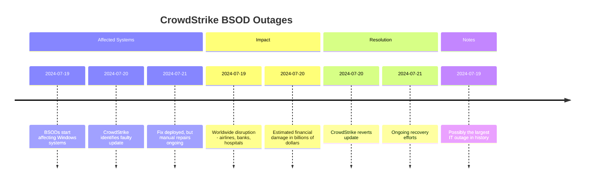

> Please note that I'm not trying to blame anyone, and my employee has nothing to do with this article. 
{: .prompt-info }

## What happened?

On Friday, July 19, 2024, a major cybersecurity company, CrowdStrike, released a sensor update for their XDR agent named Falcon. This update triggered a global IT outage, affecting approximately 8.5 million Windows devices. The devices crashed and went into a Blue Screen of Death (BSOD) loop following the update. Critical services, including telecommunications, banking, airlines, railways, supermarkets, hospitals, and major news networks, were severely impacted. CrowdStrike’s CEO confirmed that the issue was not a security incident or cyberattack.

## Who were affected?

Unfortunately, a lot of critical organizations, including airports, airlines[^timelapse], hospitals, and some of the 911 hotline systems[^hotlines], were down as well.
Even though "only" 8.5 million devices were affected, which is less than 1% of devices running Microsoft[^microsoft], a lot of people's lives were affected too. Hospitals had to delay many surgeries, people couldn't travel for a while, and many supermarket kiosks were down as well.

## First response from CrowdStrike

A few hours into the outage, companies realized what had happened, so CrowdStrike's CEO announced that they were investigating the issue at the moment.

{: width="597" height="370" }

The first post didn't achieve what it was meant to, at least based on the community's reaction. But given the situation's impact, it was totally understandable at that moment.

{: width="591" height="111" }
{: width="588" height="98" }

Some people bought domains to make fun of the company, but... Threat Actors did that too. We'll talk about that later on.

{: width="407" height="224" }
{: width="431" height="221" }

A little bit later, CrowdStrike and even Microsoft published several official posts regarding the incident and the state of the recovery process.

## But what caused the BSOD?

That's a really good question. Based on the official post[^post1], the issue was caused by faulty channel files, basically configuration files. Initially, they were mistaken for Windows kernel drivers due to their .sys extension.

But you might wonder, what are these used for?
> Channel File 291 controls how Falcon evaluates named pipe[^pipes] execution on Windows systems. Named pipes are used for normal, interprocess or intersystem communication in Windows.
Basically, a channel file contains specific monitoring and response rules for the sensor. It tells the agent what counts as suspicious activities and how it should react to the identified threat by (e.g.,) removing a malicious file, killing a process, or isolating the endpoint. These files can also contain settings regarding the communications between the XDR and the cloud-based management platform.

Some early reports suggested that the issue was caused by NULL bytes present in the channel files. Later, CrowdStrike clarified that it was caused by a logic error. 

## The solution...

After the engineers realized what went wrong, they figured out the first solution:

- Boot Windows into Safe Mode or the Windows Recovery Environment
- Navigate to the C:\Windows\System32\drivers\CrowdStrike directory
- Locate the file matching 'C-0000029*.sys', and delete it.
- Boot the host normally.

Of course, this solution is for the simplest scenarios, but there were hundreds of thousands of machines with BitLocker turned on or running at a cloud host provider.

> Find the official remediation guides here: https://www.crowdstrike.com/falcon-content-update-remediation-and-guidance-hub/
{: .prompt-info }

## Threat Actors jumped right on the train

Unfortunately, attackers wanted to take a slice of the bitter pie. They immediately bought several misleading domains for malicious purposes, such as using them to deliver fake hotfixes and steal credentials. Any.Run has already found a malicious "hotfix"[^anyrun1] that delivers Remcos malware to the victim's machine. I believe this will continue for a while.

> Please be cautious out there and only use the official site for any kind of communication and downloading anything.
{: .prompt-warning }

## What happens after this?

Obviously, people are questioning how CrowdStrike didn't notice this issue before releasing it to the public and they are demanding answers. In my opinion, this will impact supplier quality control in the future. Maybe governments will create new regulations to ensure this won't happen again, but at the moment, we cannot be sure. Companies are still recovering, and most of them aren't fully back yet.

## Timeline

[^post1]: <https://www.crowdstrike.com/blog/falcon-update-for-windows-hosts-technical-details/>
[^pipes]: <https://learn.microsoft.com/en-us/windows/win32/ipc/named-pipes>
[^timelapse]: <https://www.instagram.com/reel/C9mrMltpPsM/>
[^hotlines]: <https://www.npr.org/2024/07/21/nx-s1-5046700/the-crowdstrike-outage-disrupted-many-industries-hospitals-were-especially-vulnerable>
[^microsoft]: <https://www.bbc.com/news/articles/cpe3zgznwjno>
[^anyrun1]: <https://app.any.run/tasks/5f515fa2-bd4a-49fd-88e2-d35b0c8376d9/>

